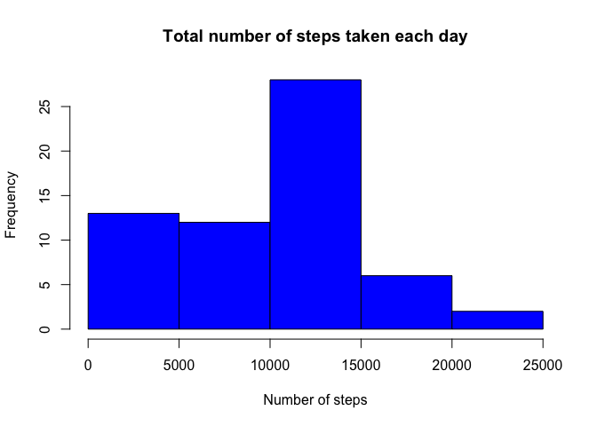
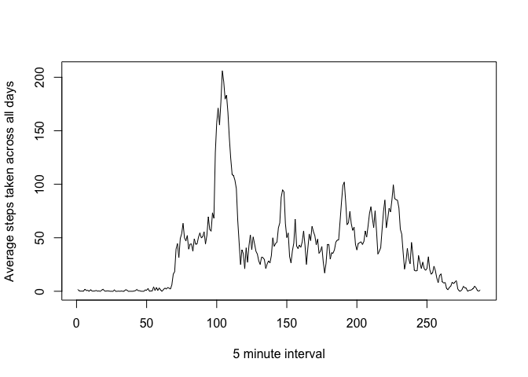

# Reproducible Research: Peer Assessment 1

## Load external libraries

```r
library(dplyr)
```

```
## 
## Attaching package: 'dplyr'
## 
## The following objects are masked from 'package:stats':
## 
##     filter, lag
## 
## The following objects are masked from 'package:base':
## 
##     intersect, setdiff, setequal, union
```

## Loading and preprocessing the data
Load the data and process/transform the data for analysis


```r
    activityData<-read.csv("activity.csv")
```


## What is mean total number of steps taken per day?
Ignore the missing values in the dataset

1. Calculate the total number of steps taken per day

```r
    totalSteps<-tapply(activityData$steps,activityData$date,sum,na.rm=TRUE)
```

2. Make a histogram of the total number of steps taken each day

```r
   hist(totalSteps,col="blue", xlab="Number of steps",main = "Total number of steps taken each day")
```

 

3. Calculate and report the mean and median of the total number of steps taken per day

```r
   mean<-mean(totalSteps)
   median<-median(totalSteps)
```

## What is the average daily activity pattern?
1. Make a time series plot (i.e. type = "l") of the 5-minute interval (x-axis) and the average number of steps taken, averaged across all days (y-axis)

```r
  meanSteps<-tapply(activityData$steps,activityData$interval,mean,na.rm=TRUE)
  
  plot(meanSteps,unique(activityData$nterval),type="l",xlab="5 minute interval",ylab="Average steps taken across all days")
```

 

2. Which 5-minute interval, on average across all the days in the dataset, contains the maximum number of steps?


## Imputing missing values


## Are there differences in activity patterns between weekdays and weekends?
