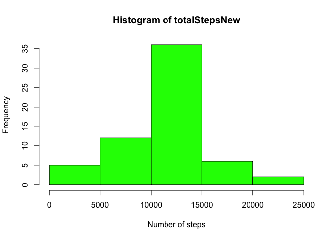
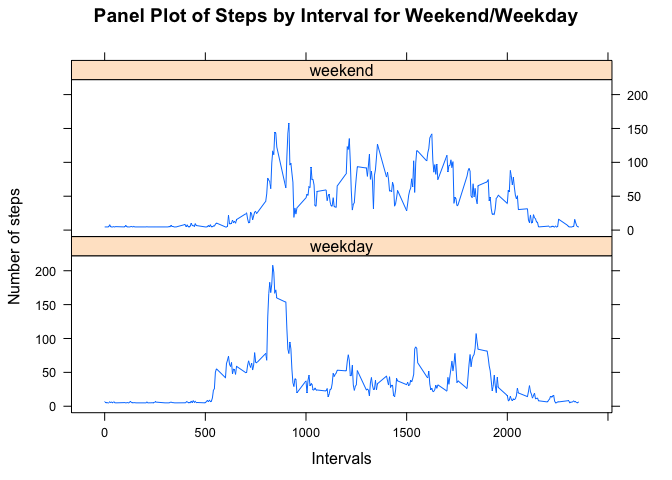

# Reproducible Research: Peer Assessment 1

## Load external libraries

```r
library(datasets)
library(dplyr)
```

```
## 
## Attaching package: 'dplyr'
## 
## The following objects are masked from 'package:stats':
## 
##     filter, lag
## 
## The following objects are masked from 'package:base':
## 
##     intersect, setdiff, setequal, union
```

```r
library(lattice)
```

## Loading and preprocessing the data
Load the data and process/transform the data for analysis


```r
    activityData<-read.csv("activity.csv")
```


## What is mean total number of steps taken per day?
Ignore the missing values in the dataset

1. Calculate the total number of steps taken per day

```r
    totalSteps<-tapply(activityData$steps,activityData$date,sum,na.rm=TRUE)
```

2. Make a histogram of the total number of steps taken each day

```r
   hist(totalSteps,col="blue", xlab="Number of steps",main = "Total number of steps taken each day")
```

 

3. Calculate and report the mean and median of the total number of steps taken per day

```r
   mean(totalSteps)
```

```
## [1] 9354.23
```

```r
   median(totalSteps)
```

```
## [1] 10395
```

## What is the average daily activity pattern?
1. Make a time series plot (i.e. type = "l") of the 5-minute interval (x-axis) and the average number of steps taken, averaged across all days (y-axis)

```r
  meanSteps<-tapply(activityData$steps,activityData$interval,mean,na.rm=TRUE)
  plot(meanSteps,unique(activityData$nterval),type="l",xlab="5 minute interval",ylab="Average steps taken across all days")
```

 

2. Which 5-minute interval, on average across all the days in the dataset, contains the maximum number of steps?

```r
for(i in 1:length(unique(activityData$interval)))
{
  if(meanSteps[i]==max(meanSteps))
  {
    name<- names(meanSteps[i])
    print(name)
    print(max(meanSteps))
  }
  
}
```

```
## [1] "835"
## [1] 206.1698
```

## Imputing missing values
1.Calculate and report the total number of missing values in the dataset (i.e. the total number of rows with NAs)

```r
    length(which(is.na(activityData$steps)))
```

```
## [1] 2304
```

2. Devise a strategy for filling in all of the missing values in the dataset. The strategy does not need to be sophisticated. For example, you could use the mean/median for that day, or the mean for that 5-minute interval, etc.

```r
    activityDataTemp <- replace(activityData$steps , is.na(activityData$steps) , mean(meanSteps))
```

3. Create a new dataset that is equal to the original dataset but with the missing data filled in.

```r
  activityDataNew <- data.frame(activityDataTemp , activityData$date , activityData$interval)
  colnames(activityDataNew)<- c("steps", "date", "interval")
  head(activityDataNew)
```

```
##     steps       date interval
## 1 37.3826 2012-10-01        0
## 2 37.3826 2012-10-01        5
## 3 37.3826 2012-10-01       10
## 4 37.3826 2012-10-01       15
## 5 37.3826 2012-10-01       20
## 6 37.3826 2012-10-01       25
```

4. Make a histogram of the total number of steps taken each day and Calculate and report the mean and median total number of steps taken per day. Do these values differ from the estimates from the first part of the assignment? What is the impact of imputing missing data on the estimates of the total daily number of steps?

```r
    totalStepsNew <-tapply(activityDataNew$steps,activityDataNew$date,sum,na.rm=TRUE)
    hist(totalStepsNew,col="green", xlab="Number of steps",ylab="Frequency")
```

 

```r
    mean(totalStepsNew)
```

```
## [1] 10766.19
```

```r
    median(totalStepsNew)
```

```
## [1] 10766.19
```
The mean and median are higher in value than from the first part of the assignment. The impact of inputting the mean values
instead of "na" has caused the total daily number of steps to increase

## Are there differences in activity patterns between weekdays and weekends?
1. Create a new factor variable in the dataset with two levels – “weekday” and “weekend” indicating whether a given date is a weekday or weekend day.

```r
    dayType<-ifelse(weekdays(as.Date(activityDataNew$date)) %in% c('Saturday','Sunday'), "weekend", "weekday")
    activityDataNew<-data.frame(activityDataNew,dayType)
    head(activityDataNew)
```

```
##     steps       date interval dayType
## 1 37.3826 2012-10-01        0 weekday
## 2 37.3826 2012-10-01        5 weekday
## 3 37.3826 2012-10-01       10 weekday
## 4 37.3826 2012-10-01       15 weekday
## 5 37.3826 2012-10-01       20 weekday
## 6 37.3826 2012-10-01       25 weekday
```

2. Make a panel plot containing a time series plot (i.e. type = "l") of the 5-minute interval (x-axis) and the average number of steps taken, averaged across all weekday days or weekend days (y-axis). See the README file in the GitHub repository to see an example of what this plot should look like using simulated data.

```r
    averageSteps <- vector()
    averageIntervals <- vector()
    averageWeekType <- vector()
    for(i in unique(activityDataNew$interval))
    {
      for(t in levels(activityDataNew$dayType))
      {
        averageSteps <- append(averageSteps 
                               , mean(activityDataNew$steps[activityDataNew$interval == i & activityDataNew$dayType== t]))
        averageIntervals <- append( averageIntervals , i)
        averageWeekType <- append(averageWeekType , t)
      }
    }
    xyplot(averageSteps ~ averageIntervals | averageWeekType
           ,main="Panel Plot of Steps by Interval for Weekend/Weekday"
           ,xlab = "Intervals" , ylab = "Number of steps"  , type='l' , layout = c(1,2))
```

 

